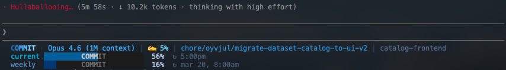

# Claude Statusline

A custom three-line status bar for [Claude Code](https://docs.anthropic.com/en/docs/claude-code) that shows model info, context usage, rate limits, and git status — all in an ocean blue color scheme.



## Tested on

- [x] macOS
- [x] Windows Terminal
- [ ] Linux

## What it shows

**Line 1** — Gradient "COMMIT" label `·` model name | ✍️ context % | branch (with dirty indicator `*`) | repo name | subdirectory (when not at repo root) — pipe-separated

**Line 2** — `current` label + progress bar with centered "COMMIT" text + percentage + reset countdown

**Line 3** — `weekly` label + progress bar with centered "COMMIT" text + percentage + reset countdown

Rate limit data is fetched from the Anthropic API and cached for 3 minutes.

## Install

```sh
npm install
npm run build
npm run configure
```

- `npm install` — installs TypeScript and type definitions
- `npm run build` — compiles `src/*.ts` to `dist/*.js`
- `npm run configure` — writes `statusLine` config to `~/.claude/settings.json`

Restart Claude Code to see the status line.

## Requirements

- Node.js 22+, `git`
- OAuth token via macOS Keychain (on macOS) or `~/.claude/.credentials.json` (all platforms)

## Customization

Colors are defined as RGB values in `src/utils/theme.ts`. The progress bar width, label text, and fill colors can be adjusted in `src/render.ts` (`renderCommitBar`) and the `buildUsageLine` calls in `src/main.ts`.
